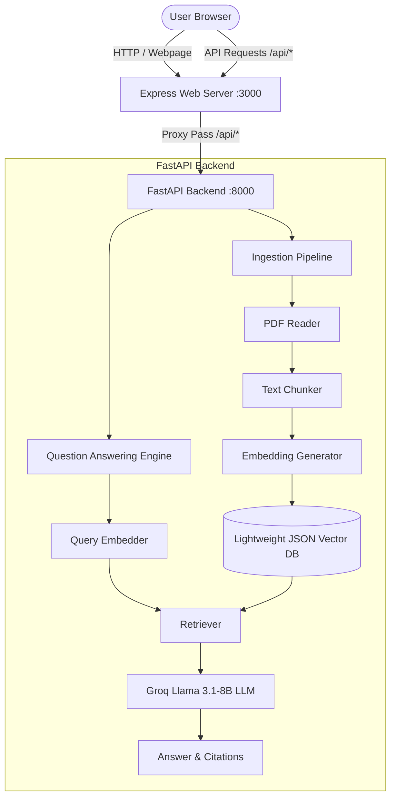

# LegalRAG - Document Assistant

LegalRAG is a web application designed to parse, query, and analyze legal documents (such as NDAs, contracts, and policies) using a Retrieval-Augmented Generation (RAG) pipeline. It allows users to upload PDF documents and submit text queries to retrieve answers with citations referencing the source files and page numbers.

---

## Architecture Overview

The project is structured as a hybrid application combining a Node.js Express frontend/proxy server with a FastAPI (Python) REST backend.



---

## Features

- **Multi-Document Ingestion:** Upload multiple PDFs to the library.
- **Semantic Retrieval:** Uses vector embeddings to find relevant passages based on semantic context rather than exact keyword matches.
- **Text Explanations:** Utilizes Groq's Llama 3.1-8B model to generate responses based on the uploaded context.
- **Source Citations:** Lists the source filenames and page numbers for the references used in the response.
- **Local Data Storage:** Uses a lightweight JSON file to store vector embeddings, avoiding the need for an external database setup.
- **Configurable Embedding Providers:** Supports Gemini, OpenAI, Hugging Face, or a local fallback module.

---

## Technology Stack

### Frontend & Proxy Server
- **UI:** HTML, CSS (layout, sidebar, and theme control), and vanilla JavaScript.
- **Web Server:** Node.js, Express (serves static assets, proxies `/api/*` requests to the Python backend, and spawns the FastAPI subprocess during local development).

### Backend
- **Framework:** FastAPI, Uvicorn.
- **PDF Extraction:** `pypdf`.
- **LLM Integration:** Groq Python SDK (`llama-3.1-8b-instant` with retry handling).
- **Embeddings:**
  - Google Gemini API (`models/text-embedding-004`)
  - OpenAI API (`text-embedding-3-small`)
  - Hugging Face Inference API (`sentence-transformers/all-MiniLM-L6-v2`)
  - Local Fallback (Deterministic hashing vectorizer)

---

## Configuration & Environment Variables

Create or edit the `.env` file in the root directory:

```ini
# Groq API Key (Required for LLM query responses)
GROQ_API_KEY=your-groq-api-key

# Embedding Provider (Options: auto, gemini, openai, huggingface, local)
EMBEDDING_PROVIDER=auto

# Optional API Keys for Embeddings
GEMINI_API_KEY=your-gemini-api-key
OPENAI_API_KEY=your-openai-api-key
HF_TOKEN=your-huggingface-token

# Server Settings
PORT=3000
FASTAPI_URL=http://localhost:8000
```

---

## Local Setup & Installation

### Prerequisites
- Node.js (v18.0.0 or higher)
- Python (v3.9 to v3.11 recommended)

### Step 1: Install Python Dependencies
Run the following command from the project root:
```bash
pip install -r requirements.txt
```

### Step 2: Install Node.js Dependencies
Run the following command from the project root:
```bash
npm install
```

### Step 3: Run the Application
Start the Node.js server. The process automatically starts the FastAPI backend when `FASTAPI_URL` is set to localhost:
```bash
npm start
```
Open the application in a browser at: **`http://localhost:3000`**

---

## Deployment & Containerization

### Docker Setup
A `Dockerfile` is provided in the project root to bundle the Node.js server and the Python backend in a single container.

1. **Build the image:**
   ```bash
   docker build -t legalrag:latest .
   ```
2. **Run the container:**
   ```bash
   docker run -p 3000:3000 --env-file .env legalrag:latest
   ```

### Cloud Deployment (Render)
A `render.yaml` specification is provided to deploy the application on Render using Docker:

1. Connect the repository to Render.
2. The platform will automatically parse the `render.yaml` configuration.
3. Define the required environment variables (e.g., `GROQ_API_KEY`) within the Render dashboard settings.
